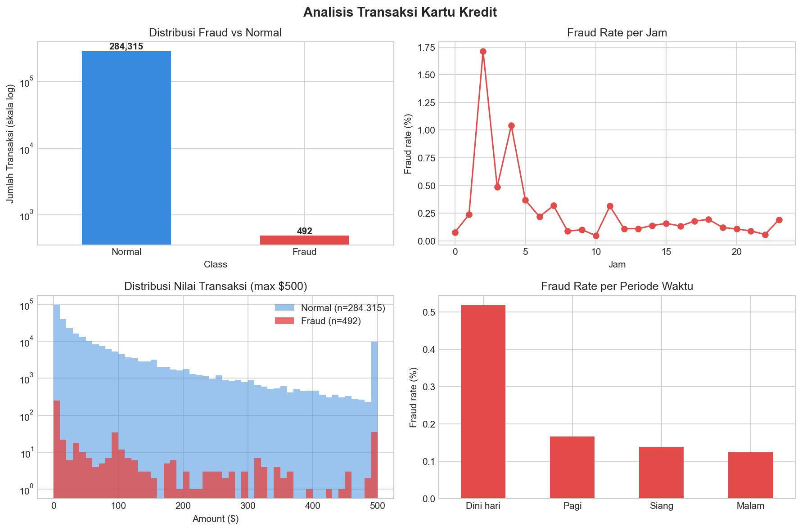

# Credit Card Fraud Analysis

Analisis eksploratif (EDA) transaksi kartu kredit untuk mendeteksi pola fraud menggunakan Python dan SQL.

## Temuan Utama
- Hanya **0.17%** transaksi adalah fraud (492 dari 284.807 transaksi)
- Fraud paling sering terjadi pada **jam 02.00 dini hari** dengan fraud rate 1.71% — 10x lipat rata-rata
- Rata-rata nilai transaksi fraud (**$122**) lebih tinggi dari transaksi normal ($88)
- Periode **dini hari (00.00–06.00)** memiliki fraud rate 4x lebih tinggi dibanding malam hari

## Rekomendasi Bisnis
1. Tingkatkan verifikasi OTP untuk transaksi yang terjadi pukul 00.00–06.00
2. Flag otomatis transaksi di atas $100 yang terjadi dini hari
3. Perkuat monitoring real-time di periode dini hari

## Visualisasi


## Tools yang Digunakan
- Python (Pandas, NumPy, Matplotlib, Seaborn)
- SQL (pandasql)
- VS Code + Jupyter Notebook

## Dataset
[Credit Card Fraud Detection - Kaggle](https://www.kaggle.com/datasets/mlg-ulb/creditcardfraud)

## Cara Menjalankan
```bash
pip install -r requirements.txt
jupyter notebook notebooks/01_eda.ipynb
```
